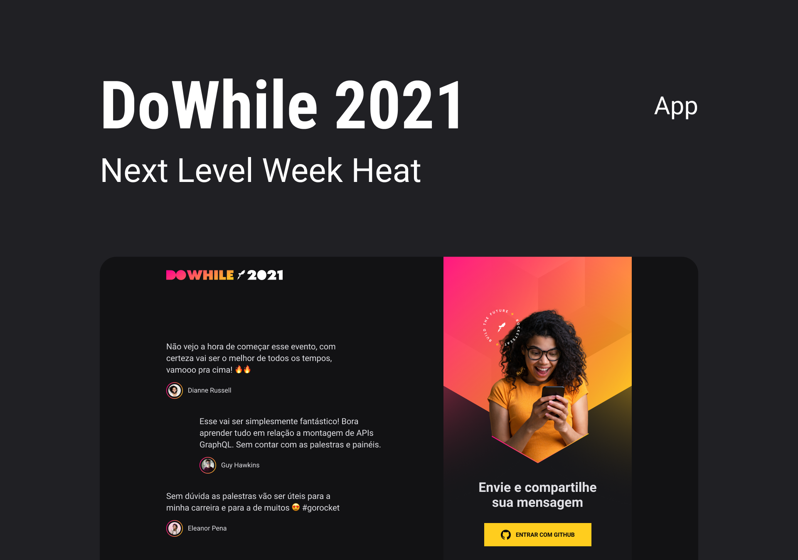

<h1 align="center">
	NLW  HEAT - DoWhile 2021
</h1>


<p align="center">
	
</p>

[**VIDEO DE DEMOSTRAÇÃO**](https://youtu.be/DOYumzeytSQ)

O DoWhile 2021 é uma aplicação onde mostra os 3 últimos comentário sobre o DoWhile. Uma aplicação que possui login social (Github), formulário para o enviado da mensagem e atualização em tempo real das 3 ultimas mensagem utilizando [Socket.IO.](https://socket.io/)

**OBS: Foi construidor um backend que é intergrado a este projeto: [BACKEND.](https://github.com/nivaldoandrade/node-heat)**


## **Configurações Iniciais**

```
  # clonar o repositório
  git clone https://github.com/nivaldoandrade/react-heat

  # Instalar as dependências dentro da pasta clonada
  yarn

  # Iniciar a aplicação
  yarn dev

```

## **Configurações do Git Hub APP**

Necessário a criação de um [OAuth Apps](https://github.com/settings/developers)

Para mais informações sobre o Git Hub APP: [DOCUMENTAÇÃO DO GITHUB APP.](https://docs.github.com/en/developers/apps/building-oauth-apps/authorizing-oauth-apps)

Depois de configurado, inserir a **GITHUB KEY CLIENT ID** no arquivo **.env.local** na raiz do projeto, possui um arquivo de exemplo **.env.local.example**.

## **Tecnologias**
- ReactJS;
- Vite.js;
- Axios;
- React-icons;
- React-responsive;
- Socket.io;
- Styled-components;
- Typescript.


### **Um pequeno aprendiz nesse grande mundo da programação.** 😃🗺

<p>
	<h6>Developed on Next Level Week Heat from <a href="https://rocketseat.com.br">RocketSeat</a> by <a href="https://www.linkedin.com/in/diego-schell-fernandes/?originalSubdomain=br">Diego Fernandes.</a></h6>
</p>
